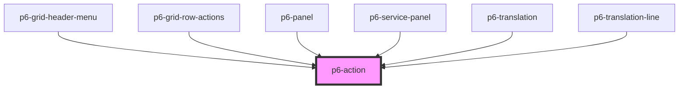

# p6-action

<!-- Auto Generated Below -->

## Properties

| Property   | Attribute  | Description                                          | Type                                                                                       | Default        |
| ---------- | ---------- | ---------------------------------------------------- | ------------------------------------------------------------------------------------------ | -------------- |
| `disabled` | `disabled` | If `true`, the user cannot interact with the Action. | `boolean`                                                                                  | `false`        |
| `mode`     | `mode`     | set the mode of the action                           | `Mode.danger \| Mode.default \| Mode.info \| Mode.primary \| Mode.success \| Mode.warning` | `Mode.default` |
| `size`     | `size`     | set the size of the action                           | `Size.normal \| Size.small`                                                                | `Size.normal`  |
| `waiting`  | `waiting`  | If set, shows a waiting/busy indicator               | `boolean`                                                                                  | `false`        |

## Dependencies

### Used by

- [p6-grid-header-menu](../../organisms/p6-grid/components/p6-grid-header-menu)
- [p6-grid-row-actions](../../templates/p6-grid-row-actions)
- [p6-panel](../../molecules/p6-panel)
- [p6-service-panel](../../templates/p6-service-panel)
- [p6-translation](../../molecules/p6-translation)
- [p6-translation-line](../../molecules/p6-translation/components/p6-translation-line)

### Graph

---

_Built with [StencilJS](https://stenciljs.com/)_
