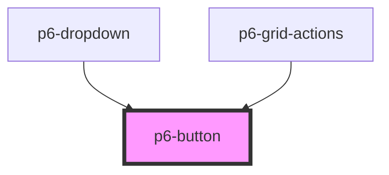

# p6-button

<!-- Auto Generated Below -->

## Properties

| Property   | Attribute  | Description                                                     | Type                                                                                       | Default        |
| ---------- | ---------- | --------------------------------------------------------------- | ------------------------------------------------------------------------------------------ | -------------- |
| `disabled` | `disabled` | Disabled - If `true`, the user cannot interact with the button. | `boolean`                                                                                  | `false`        |
| `mode`     | `mode`     | set the mode of the button                                      | `Mode.danger \| Mode.default \| Mode.info \| Mode.primary \| Mode.success \| Mode.warning` | `Mode.default` |
| `outlined` | `outlined` | Outlined                                                        | `boolean`                                                                                  | `false`        |
| `size`     | `size`     | set the size of the button                                      | `Size.normal \| Size.small`                                                                | `Size.normal`  |
| `type`     | `type`     | type of the button.                                             | `"button" \| "reset" \| "submit"`                                                          | `'submit'`     |
| `waiting`  | `waiting`  | If set, shows a waiting/busy indicator                          | `boolean`                                                                                  | `false`        |

## Dependencies

### Used by

- [p6-dropdown](../../molecules/p6-dropdown)
- [p6-grid-actions](../../organisms/p6-grid/components/p6-grid-actions)

### Graph

---

_Built with [StencilJS](https://stenciljs.com/)_
