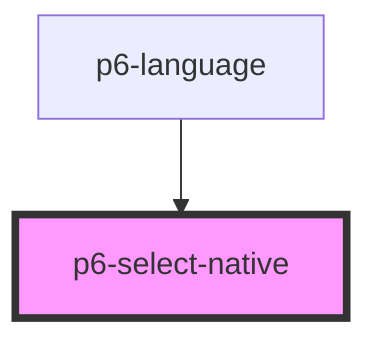

# p6-language-field

<!-- Auto Generated Below -->

## Properties

| Property            | Attribute   | Description                                                                                | Type                                                                                       | Default        |
| ------------------- | ----------- | ------------------------------------------------------------------------------------------ | ------------------------------------------------------------------------------------------ | -------------- |
| `disabled`          | `disabled`  | The select is not available for interaction. The value will not be submitted with the form | `boolean`                                                                                  | `false`        |
| `fullWidth`         | `fullwidth` | The select should take the full width                                                      | `boolean`                                                                                  | `false`        |
| `mode`              | `mode`      | The Mode of the component to display                                                       | `Mode.danger \| Mode.default \| Mode.info \| Mode.primary \| Mode.success \| Mode.warning` | `Mode.default` |
| `multiple`          | `multiple`  | Is multiple                                                                                | `boolean`                                                                                  | `false`        |
| `name` _(required)_ | `name`      | The name                                                                                   | `string`                                                                                   | `undefined`    |
| `readOnly`          | `readonly`  | Marks as read only.                                                                        | `boolean`                                                                                  | `false`        |
| `required`          | `required`  | Marks the select as required. It can't be submitted without a value                        | `boolean`                                                                                  | `false`        |

## Events

| Event              | Description                       | Type                                           |
| ------------------ | --------------------------------- | ---------------------------------------------- |
| `p6Change`         | When the value change             | `CustomEvent<ValidEventDetail<P6SelectValue>>` |
| `p6FormRegister`   | When the select ask to register   | `CustomEvent<P6Control<P6SelectValue>>`        |
| `p6FormUnregister` | When the select ask to unregister | `CustomEvent<P6Control<P6SelectValue>>`        |
| `p6Invalid`        | When the select is invalid        | `CustomEvent<InvalidEventDetail>`              |
| `p6Valid`          | When the select is valid          | `CustomEvent<ValidEventDetail<P6SelectValue>>` |

## Methods

### `checkValidity() => Promise<boolean>`

Returns whether a form will validate when it is submitted, without having to submit it.

#### Returns

Type: `Promise<boolean>`

### `reset() => Promise<boolean>`

Restores the input's default value

#### Returns

Type: `Promise<boolean>`

### `validationMessage() => Promise<string>`

Returns the error message that would be displayed if the user submits the form, or an empty string if no error message.
It also triggers the standard error message, such as "this is a required field".

#### Returns

Type: `Promise<string>`

## Dependencies

### Used by

- [p6-language](../../molecules/p6-language)

### Graph

---

_Built with [StencilJS](https://stenciljs.com/)_
