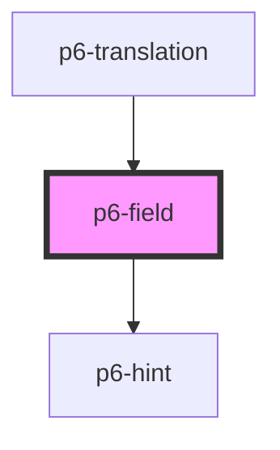

# p6-field

<!-- Auto Generated Below -->

## Dependencies

### Used by

- [p6-translation](../p6-translation)

### Depends on

- [p6-hint](../../atoms/p6-hint)

### Graph

---

_Built with [StencilJS](https://stenciljs.com/)_
