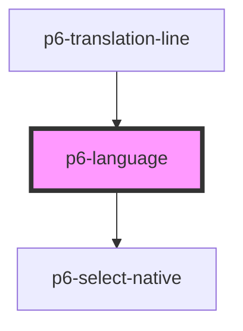

# p6-language-field

<!-- Auto Generated Below -->

## Properties

| Property            | Attribute   | Description                                                                                | Type                                                                                       | Default        |
| ------------------- | ----------- | ------------------------------------------------------------------------------------------ | ------------------------------------------------------------------------------------------ | -------------- |
| `disabled`          | `disabled`  | The select is not available for interaction. The value will not be submitted with the form | `boolean`                                                                                  | `false`        |
| `excludes`          | --          | Values to exclude from the language list                                                   | `string[]`                                                                                 | `[]`           |
| `fullWidth`         | `fullwidth` | The select should take the full width                                                      | `boolean`                                                                                  | `false`        |
| `mode`              | `mode`      | The Mode of the component to display                                                       | `Mode.danger \| Mode.default \| Mode.info \| Mode.primary \| Mode.success \| Mode.warning` | `Mode.default` |
| `name` _(required)_ | `name`      | The name                                                                                   | `string`                                                                                   | `undefined`    |
| `readOnly`          | `readonly`  | Marks as read only.                                                                        | `boolean`                                                                                  | `false`        |
| `required`          | `required`  | Marks the select as required. It can't be submitted without a value                        | `boolean`                                                                                  | `false`        |
| `value`             | `value`     | The selected value                                                                         | `string`                                                                                   | `''`           |

## Dependencies

### Used by

- [p6-translation-line](../p6-translation/components/p6-translation-line)

### Depends on

- [p6-select-native](../../atoms/p6-select-native)

### Graph

---

_Built with [StencilJS](https://stenciljs.com/)_
