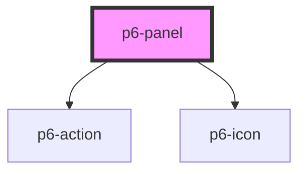

# p6-panel

<!-- Auto Generated Below -->

## Properties

| Property   | Attribute  | Description            | Type      | Default |
| ---------- | ---------- | ---------------------- | --------- | ------- |
| `hideable` | `hideable` | Set the panel hideable | `boolean` | `false` |

## Dependencies

### Depends on

- [p6-action](../../atoms/p6-action)
- [p6-icon](../../atoms/p6-icon)

### Graph

---

_Built with [StencilJS](https://stenciljs.com/)_
