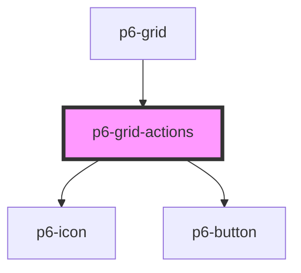

# p6-grid-options

<!-- Auto Generated Below -->

## Properties

| Property               | Attribute      | Description                   | Type                                | Default     |
| ---------------------- | -------------- | ----------------------------- | ----------------------------------- | ----------- |
| `columns` _(required)_ | --             | List of grid columns          | `Column<Record<string, unknown>>[]` | `undefined` |
| `hideOptions`          | `hide-options` | Hide grid options             | `boolean`                           | `false`     |
| `searchValue`          | `search-value` | Value used to filter the data | `string \| undefined`               | `undefined` |

## Events

| Event                      | Description                   | Type                                  |
| -------------------------- | ----------------------------- | ------------------------------------- |
| `p6FilterRows`             | Update the data filter        | `CustomEvent<FilterRowsDetail>`       |
| `p6ResetCustomDefinitions` | Reset the grid configuration  | `CustomEvent<ResetDefinitionsDetail>` |
| `p6ShowOptions`            | Show or hide the grid options | `CustomEvent<ShowOptionsDetail>`      |

## Dependencies

### Used by

- [p6-grid](../..)

### Depends on

- [p6-icon](../../../../atoms/p6-icon)
- [p6-button](../../../../atoms/p6-button)

### Graph

---

_Built with [StencilJS](https://stenciljs.com/)_
