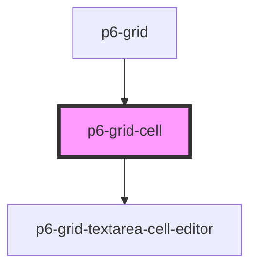

# p6-grid-cell

<!-- Auto Generated Below -->

## Properties

| Property              | Attribute  | Description                                           | Type                                                   | Default           |
| --------------------- | ---------- | ----------------------------------------------------- | ------------------------------------------------------ | ----------------- |
| `align`               | `align`    | Cell alignment                                        | `Alignment.center \| Alignment.end \| Alignment.start` | `Alignment.start` |
| `color`               | `color`    | Cell text color                                       | `string \| undefined`                                  | `undefined`       |
| `column` _(required)_ | --         | Cell column                                           | `Column<Record<string, unknown>>`                      | `undefined`       |
| `editable`            | `editable` | Set to true if this cell is editable, otherwise false | `boolean`                                              | `false`           |
| `row` _(required)_    | --         | Cell line                                             | `Row<Record<string, unknown>>`                         | `undefined`       |
| `width`               | `width`    | Cell width                                            | `number \| string`                                     | `DEFAULT_WIDTH`   |

## Dependencies

### Used by

- [p6-grid](../..)

### Depends on

- [p6-grid-textarea-cell-editor](../p6-grid-textarea-cell-editor)

### Graph

---

_Built with [StencilJS](https://stenciljs.com/)_
