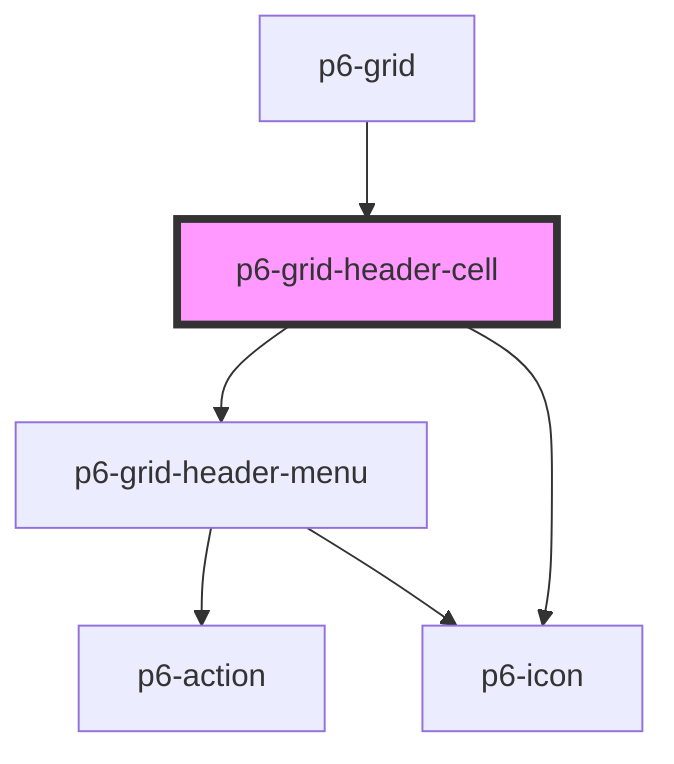

# p6-grid-cell

<!-- Auto Generated Below -->

## Properties

| Property              | Attribute    | Description                            | Type                                                | Default          |
| --------------------- | ------------ | -------------------------------------- | --------------------------------------------------- | ---------------- |
| `column` _(required)_ | --           | the column                             | `Column<Record<string, unknown>>`                   | `undefined`      |
| `disabled`            | `disabled`   | Disabled templating                    | `boolean`                                           | `false`          |
| `sortOrder`           | `sort-order` | Displays the sort order of this column | `SortOrder.asc \| SortOrder.desc \| SortOrder.none` | `SortOrder.none` |
| `width`               | `width`      | Cell width                             | `number \| string`                                  | `DEFAULT_WIDTH`  |

## Dependencies

### Used by

- [p6-grid](../..)

### Depends on

- [p6-grid-header-menu](../p6-grid-header-menu)
- [p6-icon](../../../../atoms/p6-icon)

### Graph

---

_Built with [StencilJS](https://stenciljs.com/)_
