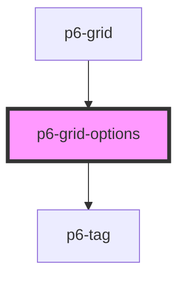

# p6-grid-options

<!-- Auto Generated Below -->

## Properties

| Property               | Attribute | Description          | Type                                | Default     |
| ---------------------- | --------- | -------------------- | ----------------------------------- | ----------- |
| `columns` _(required)_ | --        | List of grid columns | `Column<Record<string, unknown>>[]` | `undefined` |

## Events

| Event          | Description                         | Type                                                      |
| -------------- | ----------------------------------- | --------------------------------------------------------- |
| `p6ShowColumn` | Update the visibility of the column | `CustomEvent<ColumnEventDetail<Record<string, unknown>>>` |

## Dependencies

### Used by

- [p6-grid](../..)

### Depends on

- [p6-tag](../../../../atoms/p6-tag)

### Graph

---

_Built with [StencilJS](https://stenciljs.com/)_
