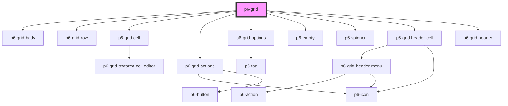

# p6-grid

<!-- Auto Generated Below -->

## Properties

| Property                   | Attribute | Description                              | Type                                                            | Default     |
| -------------------------- | --------- | ---------------------------------------- | --------------------------------------------------------------- | ----------- |
| `customContextMenu`        | --        | Display a context menu based on row data | `((row: Row<Record<string, unknown>>) => Element) \| undefined` | `undefined` |
| `data` _(required)_        | --        | Grid rows                                | `Record<string, unknown>[]`                                     | `undefined` |
| `definitions` _(required)_ | --        | Grid headers                             | `ColumnDefinition<Record<string, unknown>>[]`                   | `undefined` |
| `loading`                  | `loading` | Display spinner                          | `boolean`                                                       | `false`     |

## Events

| Event                       | Description                                        | Type                                                           |
| --------------------------- | -------------------------------------------------- | -------------------------------------------------------------- |
| `p6GridConfigurationChange` | Listen to change event to get updated p6-grid data | `CustomEvent<{ columns: Column<Record<string, unknown>>[]; }>` |
| `p6GridRowDataChange`       | Listen to change event to get updated p6-grid data | `CustomEvent<{ row: Record<string, unknown>[]; }>`             |

## Methods

### `cloneRow(rowId: RowId) => Promise<RowId>`

clone a row

#### Returns

Type: `Promise<string>`

### `getColumns() => Promise<Column<DataItem>[]>`

Get the columns of the grid

#### Returns

Type: `Promise<Column<Record<string, unknown>>[]>`

### `selectRows(rowIds: RowId[] | 'all') => Promise<boolean>`

Select a list of rows

#### Returns

Type: `Promise<boolean>`

### `startEditingCell(rowId: RowId, columnId: ColumnId) => Promise<void>`

Start editing a cell

#### Returns

Type: `Promise<void>`

### `stopEditingCell(rowId: RowId, columnId: ColumnId) => Promise<void>`

Stop editing a cell

#### Returns

Type: `Promise<void>`

## Dependencies

### Depends on

- [p6-grid-body](./components/p6-grid-body)
- [p6-grid-row](./components/p6-grid-row)
- [p6-grid-cell](./components/p6-grid-cell)
- [p6-grid-actions](./components/p6-grid-actions)
- [p6-grid-options](./components/p6-grid-options)
- [p6-empty](../../templates/p6-empty)
- [p6-spinner](../../atoms/p6-spinner)
- [p6-grid-header-cell](./components/p6-grid-header-cell)
- [p6-grid-header](./components/p6-grid-header)

### Graph

---

_Built with [StencilJS](https://stenciljs.com/)_
