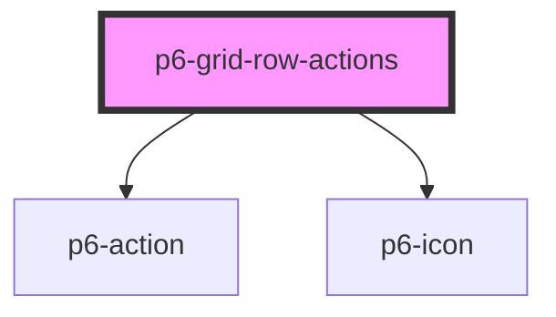

# p6-grid-row-actions

<!-- Auto Generated Below -->

## Properties

| Property             | Attribute       | Description                        | Type                          | Default     |
| -------------------- | --------------- | ---------------------------------- | ----------------------------- | ----------- |
| `isRowEdited`        | `is-row-edited` | Set to true if row is being edited | `boolean`                     | `false`     |
| `options`            | --              | options for the actions            | `ActionsOptions \| undefined` | `undefined` |
| `rowId` _(required)_ | `row-id`        | Id of the row                      | `string`                      | `undefined` |

## Events

| Event         | Description                                     | Type                              |
| ------------- | ----------------------------------------------- | --------------------------------- |
| `p6Cancel`    | Fires when the user clicks on the cancel action | `CustomEvent<{ rowId: string; }>` |
| `p6CloneRow`  | Fires when the user clicks on the clone action  | `CustomEvent<{ rowId: string; }>` |
| `p6DeleteRow` | Fires when the user clicks on the delete action | `CustomEvent<{ rowId: string; }>` |
| `p6EditRow`   | Fires when the user clicks on the edit action   | `CustomEvent<{ rowId: string; }>` |
| `p6ExportRow` | Fires when the user clicks on the export action | `CustomEvent<{ rowId: string; }>` |
| `p6RenameRow` | Fires when the user clicks on the rename action | `CustomEvent<{ rowId: string; }>` |
| `p6ViewRow`   | Fires when the user clicks on the view action   | `CustomEvent<{ rowId: string; }>` |

## Dependencies

### Depends on

- [p6-action](../../atoms/p6-action)
- [p6-icon](../../atoms/p6-icon)

### Graph

---

_Built with [StencilJS](https://stenciljs.com/)_
