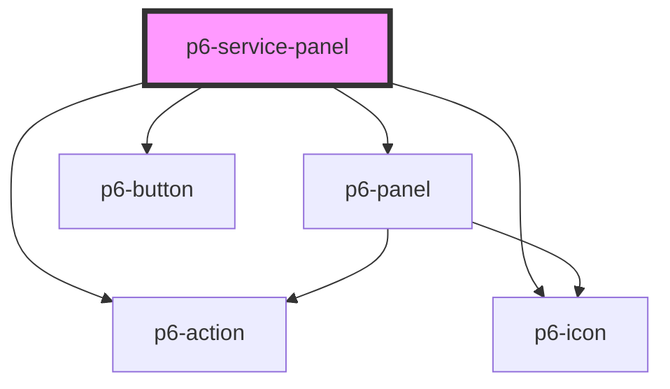

# p6-service-panel

<!-- Auto Generated Below -->

## Properties

| Property            | Attribute | Description            | Type                                                                                   | Default     |
| ------------------- | --------- | ---------------------- | -------------------------------------------------------------------------------------- | ----------- |
| `name` _(required)_ | `name`    | Name of the service    | `string`                                                                               | `undefined` |
| `status`            | `status`  | Status of the service  | `ServiceStatus.Restart \| ServiceStatus.Started \| ServiceStatus.Stopped \| undefined` | `undefined` |
| `version`           | `version` | Version of the service | `string \| undefined`                                                                  | `undefined` |

## Events

| Event              | Description                                      | Type                |
| ------------------ | ------------------------------------------------ | ------------------- |
| `p6RefreshService` | Fires when the user tries to refresh the service | `CustomEvent<void>` |
| `p6ReloadService`  | Fires when the user tries to reload the service  | `CustomEvent<void>` |
| `p6StartService`   | Fires when the user tries to start the service   | `CustomEvent<void>` |
| `p6StopService`    | Fires when the user tries to stop the service    | `CustomEvent<void>` |

## Dependencies

### Depends on

- [p6-panel](../../molecules/p6-panel)
- [p6-action](../../atoms/p6-action)
- [p6-icon](../../atoms/p6-icon)
- [p6-button](../../atoms/p6-button)

### Graph

---

_Built with [StencilJS](https://stenciljs.com/)_
