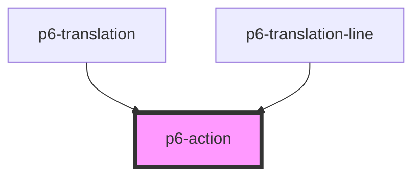

# p6-button

<!-- Auto Generated Below -->

## Properties

| Property   | Attribute  | Description                                          | Type                                                                     | Default     |
| ---------- | ---------- | ---------------------------------------------------- | ------------------------------------------------------------------------ | ----------- |
| `disabled` | `disabled` | If `true`, the user cannot interact with the Action. | `boolean`                                                                | `false`     |
| `mode`     | `mode`     | set the mode of the action                           | `"danger" \| "default" \| "info" \| "primary" \| "success" \| "warning"` | `"default"` |
| `size`     | `size`     | set the size of the action                           | `"default" \| "large" \| "medium" \| "normal" \| "small"`                | `"small"`   |
| `waiting`  | `waiting`  | If set, shows a waiting/busy indicator               | `boolean`                                                                | `false`     |

## Dependencies

### Used by

- [p6-translation](../../molecules/p6-translation)
- [p6-translation-line](../../molecules/p6-translation/p6-translation-line)

### Graph

---

_Built with [StencilJS](https://stenciljs.com/)_
