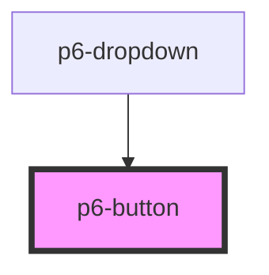

# p6-button

<!-- Auto Generated Below -->

## Properties

| Property   | Attribute  | Description                                                     | Type                                                                     | Default     |
| ---------- | ---------- | --------------------------------------------------------------- | ------------------------------------------------------------------------ | ----------- |
| `disabled` | `disabled` | Disabled - If `true`, the user cannot interact with the button. | `boolean`                                                                | `false`     |
| `mode`     | `mode`     | set the mode of the button                                      | `"danger" \| "default" \| "info" \| "primary" \| "success" \| "warning"` | `"default"` |
| `outlined` | `outlined` | Outlined                                                        | `boolean`                                                                | `false`     |
| `size`     | `size`     | set the size of the button                                      | `"default" \| "large" \| "medium" \| "normal" \| "small"`                | `"default"` |
| `type`     | `type`     | type of the button.                                             | `"button" \| "reset" \| "submit"`                                        | `"submit"`  |
| `waiting`  | `waiting`  | If set, shows a waiting/busy indicator                          | `boolean`                                                                | `false`     |

## Dependencies

### Used by

 - [p6-dropdown](../../molecules/p6-dropdown)

### Graph

----------------------------------------------

*Built with [StencilJS](https://stenciljs.com/)*
