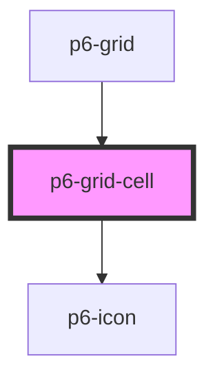

# p6-grid-cell

<!-- Auto Generated Below -->

## Properties

| Property                | Attribute   | Description           | Type                                        | Default     |
| ----------------------- | ----------- | --------------------- | ------------------------------------------- | ----------- |
| `align`                 | `align`     | Cell alignment        | `"center" \| "end" \| "start" \| undefined` | `undefined` |
| `clickCallback`         | --          | Click callback        | `((id: string) => void) \| undefined`       | `undefined` |
| `color`                 | `color`     | Cell text color       | `string \| undefined`                       | `undefined` |
| `dbleClickCallback`     | --          | Double click callback | `((id: string) => void) \| undefined`       | `undefined` |
| `disabled`              | `disabled`  | Disabled templating   | `boolean`                                   | `false`     |
| `headerId` _(required)_ | `header-id` | Header id             | `string`                                    | `undefined` |
| `width`                 | `width`     | Cell width            | `number \| string`                          | `100`       |

## Events

| Event         | Description                  | Type               |
| ------------- | ---------------------------- | ------------------ |
| `alignCenter` | Text align to the center     | `CustomEvent<any>` |
| `alignLeft`   | Text align to the left       | `CustomEvent<any>` |
| `alignRight`  | Text align to the right      | `CustomEvent<any>` |
| `hide`        | Hide column                  | `CustomEvent<any>` |
| `minus`       | Reduce column width          | `CustomEvent<any>` |
| `moveLeft`    | Move the column to the left  | `CustomEvent<any>` |
| `moveRight`   | Move the column to the right | `CustomEvent<any>` |
| `plus`        | Raise column width           | `CustomEvent<any>` |
| `setColor`    | Set color                    | `CustomEvent<any>` |
| `sort`        | Sort                         | `CustomEvent<any>` |

## Dependencies

### Used by

- [p6-grid](../../molecules/p6-grid)

### Depends on

- [p6-icon](../p6-icon)

### Graph

---

_Built with [StencilJS](https://stenciljs.com/)_
