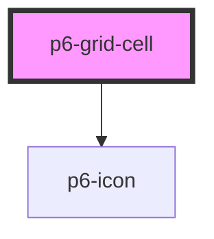

# p6-grid-cell

<!-- Auto Generated Below -->

## Properties

| Property            | Attribute             | Description                  | Type                                        | Default     |
| ------------------- | --------------------- | ---------------------------- | ------------------------------------------- | ----------- |
| `align`             | `align`               | Cell alignment               | `"center" \| "end" \| "start" \| undefined` | `undefined` |
| `clickCallback`     | `click-callback`      | Click callback               | `any`                                       | `undefined` |
| `color`             | `color`               | Cell text color              | `string \| undefined`                       | `undefined` |
| `dbleClickCallback` | `dble-click-callback` | Double click callback        | `any`                                       | `undefined` |
| `moveLeft`          | `move-left`           | Move the column to the left  | `any`                                       | `undefined` |
| `moveRight`         | `move-right`          | Move the column to the right | `any`                                       | `undefined` |
| `sort`              | `sort`                | Sort                         | `any`                                       | `undefined` |
| `width`             | `width`               | Cell width                   | `number \| string`                          | `100`       |

## Dependencies

### Depends on

- [p6-icon](../p6-icon)

### Graph

----------------------------------------------

*Built with [StencilJS](https://stenciljs.com/)*
