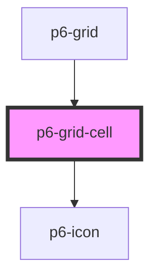

# p6-grid-cell

<!-- Auto Generated Below -->

## Properties

| Property            | Attribute | Description                  | Type                                         | Default     |
| ------------------- | --------- | ---------------------------- | -------------------------------------------- | ----------- |
| `align`             | `align`   | Cell alignment               | `"center" \| "end" \| "start" \| undefined`  | `undefined` |
| `alignCenter`       | --        | Text align to the center     | `(event: MouseEvent) => void`                | `() => {}`  |
| `alignLeft`         | --        | Text align to the left       | `(event: MouseEvent) => void`                | `() => {}`  |
| `alignRight`        | --        | Text align to the right      | `(event: MouseEvent) => void`                | `() => {}`  |
| `clickCallback`     | --        | Click callback               | `((event: MouseEvent) => void) \| undefined` | `undefined` |
| `color`             | `color`   | Cell text color              | `string \| undefined`                        | `undefined` |
| `dbleClickCallback` | --        | Double click callback        | `((event: MouseEvent) => void) \| undefined` | `undefined` |
| `hide`              | --        | Hide column                  | `(event: MouseEvent) => void`                | `() => {}`  |
| `minus`             | --        | Reduce column width          | `(event: MouseEvent) => void`                | `() => {}`  |
| `moveLeft`          | --        | Move the column to the left  | `(event: MouseEvent) => void`                | `() => {}`  |
| `moveRight`         | --        | Move the column to the right | `(event: MouseEvent) => void`                | `() => {}`  |
| `plus`              | --        | Raise column width           | `(event: MouseEvent) => void`                | `() => {}`  |
| `sort`              | --        | Sort                         | `(event: MouseEvent) => void`                | `() => {}`  |
| `toggleColor`       | --        | Toggle colorpicker           | `(event: MouseEvent) => void`                | `() => {}`  |
| `width`             | `width`   | Cell width                   | `number \| string`                           | `100`       |

## Dependencies

### Used by

 - [p6-grid](../../molecules/p6-grid)

### Depends on

- [p6-icon](../p6-icon)

### Graph

----------------------------------------------

*Built with [StencilJS](https://stenciljs.com/)*
