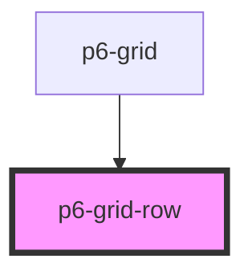

# p6-grid-row

<!-- Auto Generated Below -->

## Properties

| Property              | Attribute  | Description                         | Type                                   | Default    |
| --------------------- | ---------- | ----------------------------------- | -------------------------------------- | ---------- |
| `contextMenuCallback` | --         | Set the context menu data           | `() => void`                           | `() => {}` |
| `moveContextMenu`     | --         | Change thte context menu coordinate | `(posX: number, posY: number) => void` | `() => {}` |
| `selected`            | `selected` | Is row selected or not              | `boolean`                              | `false`    |

## Dependencies

### Used by

- [p6-grid](../../molecules/p6-grid)

### Graph

---

_Built with [StencilJS](https://stenciljs.com/)_
