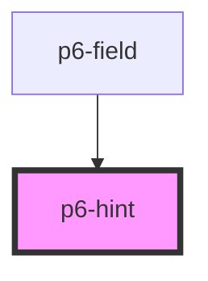

# p6-hint

<!-- Auto Generated Below -->

## Properties

| Property | Attribute | Description              | Type                                                                                       | Default        |
| -------- | --------- | ------------------------ | ------------------------------------------------------------------------------------------ | -------------- |
| `mode`   | `mode`    | set the mode of the hint | `Mode.danger \| Mode.default \| Mode.info \| Mode.primary \| Mode.success \| Mode.warning` | `Mode.default` |

## Dependencies

### Used by

- [p6-field](../../molecules/p6-field)

### Graph

---

_Built with [StencilJS](https://stenciljs.com/)_
