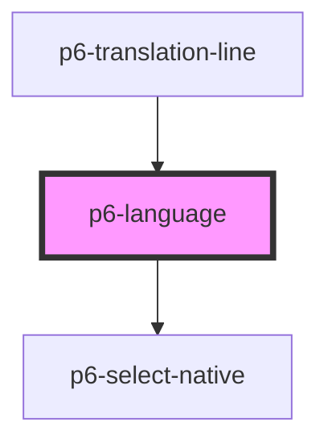

# p6-language-field

<!-- Auto Generated Below -->

## Properties

| Property            | Attribute  | Description                                                                                | Type                                                                     | Default     |
| ------------------- | ---------- | ------------------------------------------------------------------------------------------ | ------------------------------------------------------------------------ | ----------- |
| `disabled`          | `disabled` | The select is not available for interaction. The value will not be submitted with the form | `boolean`                                                                | `false`     |
| `excludes`          | --         | Values to exclude from the language list                                                   | `string[]`                                                               | `[]`        |
| `mode`              | `mode`     | The Mode of the component to display                                                       | `"danger" \| "default" \| "info" \| "primary" \| "success" \| "warning"` | `"default"` |
| `name` _(required)_ | `name`     | The name                                                                                   | `string`                                                                 | `undefined` |
| `readOnly`          | `readonly` | Marks as read only.                                                                        | `boolean`                                                                | `false`     |
| `required`          | `required` | Marks the select as required. It can't be submitted without a value                        | `boolean`                                                                | `false`     |
| `size`              | `size`     | The size of the component to display                                                       | `"default" \| "large" \| "medium" \| "normal" \| "small"`                | `"small"`   |
| `value`             | `value`    | The selected value                                                                         | `string`                                                                 | `""`        |

## Events

| Event      | Description | Type                                    |
| ---------- | ----------- | --------------------------------------- |
| `p6Change` |             | `CustomEvent<ValidEventDetail<string>>` |

## Dependencies

### Used by

- [p6-translation-line](../../molecules/p6-translation/p6-translation-line)

### Depends on

- [p6-select-native](../p6-select-native)

### Graph

---

_Built with [StencilJS](https://stenciljs.com/)_
