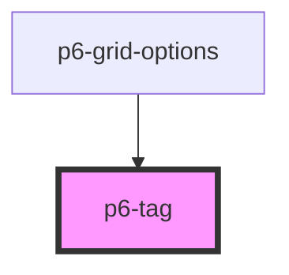

# p6-tag

<!-- Auto Generated Below -->

## Properties

| Property | Attribute | Description | Type                                                                                       | Default     |
| -------- | --------- | ----------- | ------------------------------------------------------------------------------------------ | ----------- |
| `mode`   | `mode`    | Mode        | `Mode.danger \| Mode.default \| Mode.info \| Mode.primary \| Mode.success \| Mode.warning` | `undefined` |

## Dependencies

### Used by

- [p6-grid-options](../../organisms/p6-grid/components/p6-grid-options)

### Graph

---

_Built with [StencilJS](https://stenciljs.com/)_
