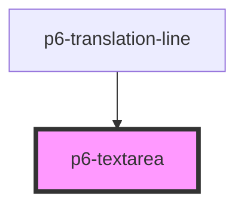

# p6-textarea

<!-- Auto Generated Below -->

## Properties

| Property            | Attribute     | Description                                                                               | Type                                                      | Default     |
| ------------------- | ------------- | ----------------------------------------------------------------------------------------- | --------------------------------------------------------- | ----------- |
| `cols`              | `cols`        | The number of columns                                                                     | `number \| undefined`                                     | `undefined` |
| `disabled`          | `disabled`    | the input is not available for interaction. The value will not be submitted with the form | `boolean`                                                 | `false`     |
| `max`               | `max`         | The maximum length or value                                                               | `number \| undefined`                                     | `undefined` |
| `min`               | `min`         | The minimum length or value                                                               | `number \| undefined`                                     | `undefined` |
| `name` _(required)_ | `name`        | The name of the input.                                                                    | `string`                                                  | `undefined` |
| `placeholder`       | `placeholder` | content to be appear in the form control when the form control is empty                   | `string \| undefined`                                     | `undefined` |
| `readOnly`          | `readonly`    | marks an element that can't be edited.                                                    | `boolean`                                                 | `false`     |
| `required`          | `required`    | marks an element that can't be submitted without a value.                                 | `boolean`                                                 | `false`     |
| `rows`              | `rows`        | The number of rows                                                                        | `number \| undefined`                                     | `undefined` |
| `size`              | `size`        | The size of the component to display                                                      | `"default" \| "large" \| "medium" \| "normal" \| "small"` | `"small"`   |
| `value`             | `value`       | the value of the input.                                                                   | `string \| undefined`                                     | `undefined` |
| `waiting`           | `waiting`     | shows a waiting indicator                                                                 | `boolean`                                                 | `false`     |

## Methods

### `checkValidity() => Promise<boolean>`

Returns whether a form will validate when it is submitted, without having to submit it.

#### Returns

Type: `Promise<boolean>`

### `validationMessage() => Promise<string>`

Returns the error message that would be displayed if the user submits the form, or an empty string if no error message.
It also triggers the standard error message, such as "this is a required field".

#### Returns

Type: `Promise<string>`

## Dependencies

### Used by

- [p6-translation-line](../../molecules/p6-translation/p6-translation-line)

### Graph

---

_Built with [StencilJS](https://stenciljs.com/)_
