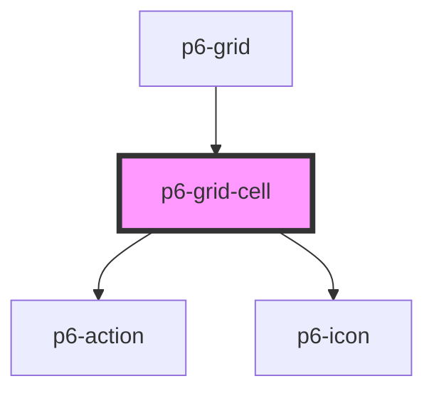

# p6-grid-cell

<!-- Auto Generated Below -->

## Properties

| Property                  | Attribute   | Description         | Type                                                                             | Default     |
| ------------------------- | ----------- | ------------------- | -------------------------------------------------------------------------------- | ----------- |
| `align`                   | `align`     | Cell alignment      | `"center" \| "end" \| "start" \| undefined`                                      | `undefined` |
| `cellIdx` _(required)_    | `cell-idx`  | Index of the cell   | `number`                                                                         | `undefined` |
| `clickCallback`           | --          | Click callback      | `((id: string) => void) \| undefined`                                            | `undefined` |
| `color`                   | `color`     | Cell text color     | `string \| undefined`                                                            | `undefined` |
| `disabled`                | `disabled`  | Disabled templating | `boolean`                                                                        | `false`     |
| `editing`                 | `editing`   | Editing mode        | `boolean`                                                                        | `false`     |
| `headerId` _(required)_   | `header-id` | Header id           | `string`                                                                         | `undefined` |
| `label`                   | `label`     | Cell label          | `string`                                                                         | `"-"`       |
| `renderCellEditComponent` | --          |                     | `((id: string, rowIdx: number, cellIdx: number) => HTMLDivElement) \| undefined` | `undefined` |
| `rowIdx`                  | `row-idx`   | Index of the row    | `number \| undefined`                                                            | `undefined` |
| `width`                   | `width`     | Cell width          | `number \| string`                                                               | `100`       |

## Events

| Event           | Description                  | Type               |
| --------------- | ---------------------------- | ------------------ |
| `p6AlignCenter` | Text align to the center     | `CustomEvent<any>` |
| `p6AlignLeft`   | Text align to the left       | `CustomEvent<any>` |
| `p6AlignRight`  | Text align to the right      | `CustomEvent<any>` |
| `p6Edit`        | Double click callback        | `CustomEvent<any>` |
| `p6Hide`        | Hide column                  | `CustomEvent<any>` |
| `p6Minus`       | Reduce column width          | `CustomEvent<any>` |
| `p6MoveLeft`    | Move the column to the left  | `CustomEvent<any>` |
| `p6MoveRight`   | Move the column to the right | `CustomEvent<any>` |
| `p6Plus`        | Raise column width           | `CustomEvent<any>` |
| `p6Sort`        | Sort                         | `CustomEvent<any>` |

## Dependencies

### Used by

- [p6-grid](../..)

### Depends on

- [p6-action](../../../../atoms/p6-action)
- [p6-icon](../../../../atoms/p6-icon)

### Graph

---

_Built with [StencilJS](https://stenciljs.com/)_
