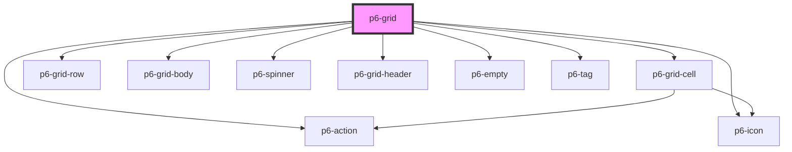

# p6-grid

<!-- Auto Generated Below -->

## Properties

| Property               | Attribute | Description                              | Type                                         | Default     |
| ---------------------- | --------- | ---------------------------------------- | -------------------------------------------- | ----------- |
| `customContextMenu`    | --        | Display a context menu based on row data | `((row: RowCell[]) => Element) \| undefined` | `undefined` |
| `headers` _(required)_ | --        | Grid headers                             | `HeaderCell[]`                               | `undefined` |
| `loading`              | `loading` | Display spinner                          | `boolean`                                    | `false`     |
| `rows` _(required)_    | --        | Grid rows                                | `Row[]`                                      | `undefined` |

## Events

| Event      | Description                                        | Type               |
| ---------- | -------------------------------------------------- | ------------------ |
| `p6Change` | Listen to change event to get updated p6-grid data | `CustomEvent<any>` |

## Dependencies

### Depends on

- [p6-grid-cell](./components/p6-grid-cell)
- [p6-grid-row](./components/p6-grid-row)
- [p6-grid-body](./components/p6-grid-body)
- [p6-spinner](../../atoms/p6-spinner)
- [p6-grid-header](./components/p6-grid-header)
- [p6-action](../../atoms/p6-action)
- [p6-icon](../../atoms/p6-icon)
- [p6-empty](../../templates/p6-empty)
- [p6-tag](../../atoms/p6-tag)

### Graph

---

_Built with [StencilJS](https://stenciljs.com/)_
