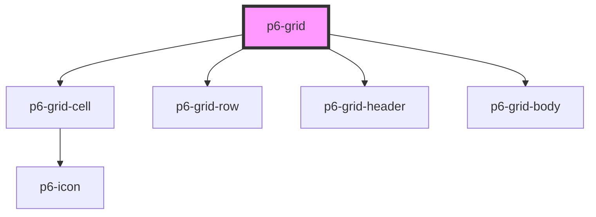

# p6-grid

<!-- Auto Generated Below -->

## Properties

| Property               | Attribute | Description  | Type                       | Default     |
| ---------------------- | --------- | ------------ | -------------------------- | ----------- |
| `headers` _(required)_ | --        | Grid headers | `HeaderCell[]`             | `undefined` |
| `rows`                 | --        | Grid rows    | `RowCell[][] \| undefined` | `[]`        |

## Dependencies

### Depends on

- [p6-grid-cell](../../atoms/p6-grid-cell)
- [p6-grid-row](../../atoms/p6-grid-row)
- [p6-grid-header](../../atoms/p6-grid-header)
- [p6-grid-body](../../atoms/p6-grid-body)

### Graph

----------------------------------------------

*Built with [StencilJS](https://stenciljs.com/)*
