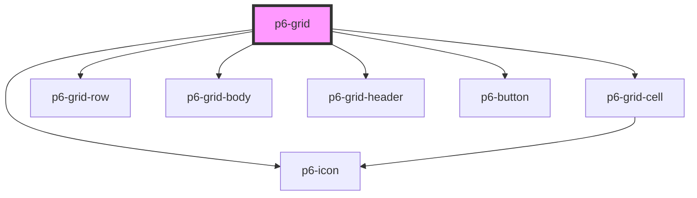

# p6-grid

<!-- Auto Generated Below -->

## Properties

| Property                          | Attribute | Description                                   | Type                                          | Default     |
| --------------------------------- | --------- | --------------------------------------------- | --------------------------------------------- | ----------- |
| `customContextMenu`               | --        | Display a context menu based on row data      | `((row: RowCell[]) => Element) \| undefined`  | `undefined` |
| `headers` _(required)_            | --        | Grid headers                                  | `HeaderCell[]`                                | `undefined` |
| `rows` _(required)_               | --        | Grid rows                                     | `Row[]`                                       | `undefined` |
| `updateGridCallback` _(required)_ | --        | Update callback after each action on the grid | `(header: HeaderCell[], rows: Row[]) => void` | `undefined` |

## Dependencies

### Depends on

- [p6-grid-cell](../../atoms/p6-grid-cell)
- [p6-grid-row](../../atoms/p6-grid-row)
- [p6-grid-body](../../atoms/p6-grid-body)
- [p6-grid-header](../../atoms/p6-grid-header)
- [p6-button](../../atoms/p6-button)
- [p6-icon](../../atoms/p6-icon)

### Graph

---

_Built with [StencilJS](https://stenciljs.com/)_
