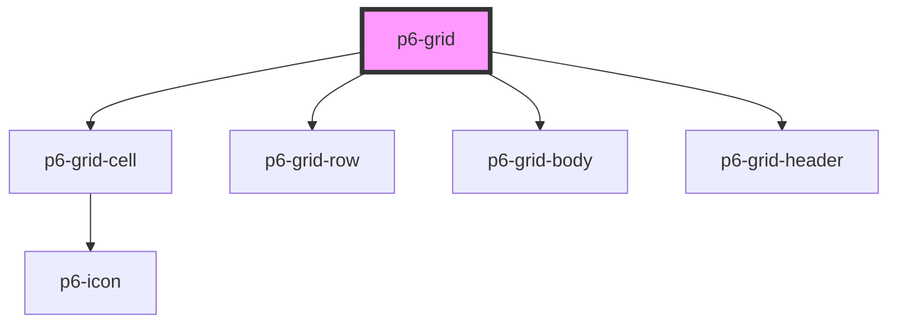

# p6-grid

<!-- Auto Generated Below -->

## Properties

| Property                          | Attribute | Description                                   | Type                                                | Default     |
| --------------------------------- | --------- | --------------------------------------------- | --------------------------------------------------- | ----------- |
| `headers` _(required)_            | --        | Grid headers                                  | `HeaderCell[]`                                      | `undefined` |
| `rows` _(required)_               | --        | Grid rows                                     | `RowCell[][]`                                       | `undefined` |
| `updateGridCallback` _(required)_ | --        | Update callback after each action on the grid | `(header: HeaderCell[], rows: RowCell[][]) => void` | `undefined` |

## Dependencies

### Depends on

- [p6-grid-cell](../../atoms/p6-grid-cell)
- [p6-grid-row](../../atoms/p6-grid-row)
- [p6-grid-body](../../atoms/p6-grid-body)
- [p6-grid-header](../../atoms/p6-grid-header)

### Graph

----------------------------------------------

*Built with [StencilJS](https://stenciljs.com/)*
