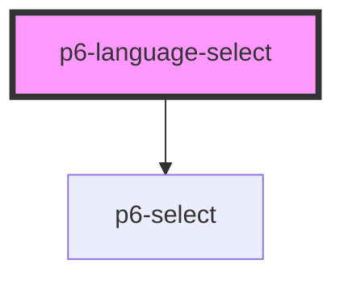

# p6-language-select

<!-- Auto Generated Below -->

## Properties

| Property            | Attribute  | Description                                                                                | Type                                                                     | Default         |
| ------------------- | ---------- | ------------------------------------------------------------------------------------------ | ------------------------------------------------------------------------ | --------------- |
| `disabled`          | `disabled` | The select is not available for interaction. The value will not be submitted with the form | `boolean`                                                                | `false`         |
| `excludes`          | `excludes` | Locales to exclude from the list                                                           | `string \| string[]`                                                     | `[]`            |
| `mode`              | `mode`     | The mode                                                                                   | `"danger" \| "default" \| "info" \| "primary" \| "success" \| "warning"` | `"default"`     |
| `name` _(required)_ | `name`     | The name                                                                                   | `string`                                                                 | `undefined`     |
| `value`             | `value`    | Default selected locale                                                                    | `string`                                                                 | `defaultLocale` |

## Dependencies

### Depends on

- [p6-select](../../atoms/p6-select)

### Graph

---

_Built with [StencilJS](https://stenciljs.com/)_
