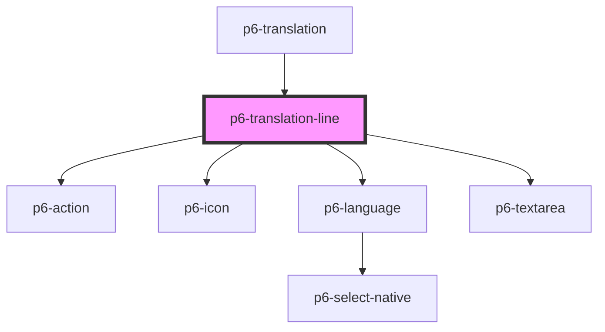

# p6-translation-line

<!-- Auto Generated Below -->

## Properties

| Property                   | Attribute     | Description             | Type       | Default     |
| -------------------------- | ------------- | ----------------------- | ---------- | ----------- |
| `disabled` _(required)_    | `disabled`    | Disabled                | `boolean`  | `undefined` |
| `excludes`                 | --            | The current translation | `string[]` | `[]`        |
| `language` _(required)_    | `language`    | The language            | `string`   | `undefined` |
| `name` _(required)_        | `name`        | The name                | `string`   | `undefined` |
| `readOnly` _(required)_    | `readonly`    | Read only               | `boolean`  | `undefined` |
| `translation` _(required)_ | `translation` | The translation         | `string`   | `undefined` |

## Events

| Event           | Description | Type                                    |
| --------------- | ----------- | --------------------------------------- |
| `p6Delete`      |             | `CustomEvent<void>`                     |
| `p6KeyChange`   |             | `CustomEvent<ValidEventDetail<string>>` |
| `p6ValueChange` |             | `CustomEvent<ValidEventDetail<string>>` |

## Dependencies

### Used by

- [p6-translation](../..)

### Depends on

- [p6-action](../../../../atoms/p6-action)
- [p6-icon](../../../../atoms/p6-icon)
- [p6-language](../../../p6-language)
- [p6-textarea](../../../../atoms/p6-textarea)

### Graph

---

_Built with [StencilJS](https://stenciljs.com/)_
