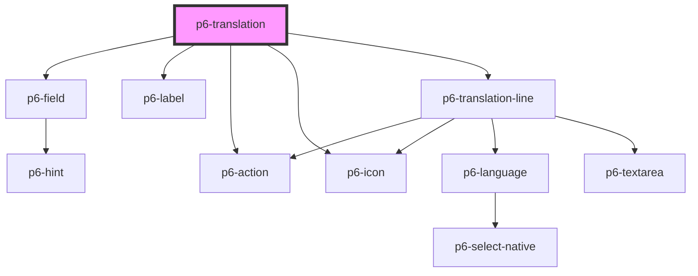

# p6-translation-field

<!-- Auto Generated Below -->

## Properties

| Property            | Attribute  | Description                                                                               | Type                                                      | Default     |
| ------------------- | ---------- | ----------------------------------------------------------------------------------------- | --------------------------------------------------------- | ----------- |
| `disabled`          | `disabled` | the input is not available for interaction. The value will not be submitted with the form | `boolean`                                                 | `false`     |
| `name` _(required)_ | `name`     | The name                                                                                  | `string`                                                  | `undefined` |
| `readOnly`          | `readonly` | Marks as read only.                                                                       | `boolean`                                                 | `false`     |
| `size`              | `size`     | The size of the component to display                                                      | `"default" \| "large" \| "medium" \| "normal" \| "small"` | `"small"`   |
| `value`             | --         | The value                                                                                 | `{ [key: string]: string; }`                              | `{}`        |

## Events

| Event              | Description | Type                                                |
| ------------------ | ----------- | --------------------------------------------------- |
| `p6FormRegister`   |             | `CustomEvent<P6Control<P6TranslationValue>>`        |
| `p6FormUnregister` |             | `CustomEvent<P6Control<P6TranslationValue>>`        |
| `p6Invalid`        |             | `CustomEvent<InvalidEventDetail>`                   |
| `p6Valid`          |             | `CustomEvent<ValidEventDetail<P6TranslationValue>>` |

## Methods

### `checkValidity() => Promise<boolean>`

Returns whether a form will validate when it is submitted, without having to submit it.

#### Returns

Type: `Promise<boolean>`

### `validationMessage() => Promise<string>`

Returns the error message that would be displayed if the user submits the form, or an empty string if no error message.
It also triggers the standard error message, such as "this is a required field".

#### Returns

Type: `Promise<string>`

## Dependencies

### Depends on

- [p6-field](../p6-field)
- [p6-label](../../atoms/p6-label)
- [p6-action](../../atoms/p6-action)
- [p6-icon](../../atoms/p6-icon)
- [p6-translation-line](p6-translation-line)

### Graph

---

_Built with [StencilJS](https://stenciljs.com/)_
