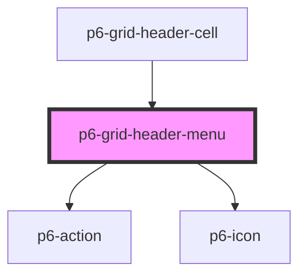

# p6-grid-cell

<!-- Auto Generated Below -->

## Properties

| Property                 | Attribute    | Description                   | Type                                                   | Default     |
| ------------------------ | ------------ | ----------------------------- | ------------------------------------------------------ | ----------- |
| `align` _(required)_     | `align`      | Cell alignment                | `Alignment.center \| Alignment.end \| Alignment.start` | `undefined` |
| `column` _(required)_    | --           | the column                    | `Column<Record<string, unknown>>`                      | `undefined` |
| `sortOrder` _(required)_ | `sort-order` | the sort order of this column | `SortOrder.asc \| SortOrder.desc \| SortOrder.none`    | `undefined` |

## Events

| Event            | Description                                 | Type                                                      |
| ---------------- | ------------------------------------------- | --------------------------------------------------------- |
| `p6AlignColumn`  | Update the alignement of the column         | `CustomEvent<ColumnEventDetail<Record<string, unknown>>>` |
| `p6MoveColumn`   | Move the column to the left or to the right | `CustomEvent<MoveColumnDetail<Record<string, unknown>>>`  |
| `p6ResizeColumn` | Resize the column                           | `CustomEvent<ColumnEventDetail<Record<string, unknown>>>` |
| `p6ShowColumn`   | Update the visibility of the column         | `CustomEvent<ColumnEventDetail<Record<string, unknown>>>` |
| `p6SortColumn`   | Sort the column                             | `CustomEvent<ColumnEventDetail<Record<string, unknown>>>` |

## Dependencies

### Used by

- [p6-grid-header-cell](../p6-grid-header-cell)

### Depends on

- [p6-action](../../../../atoms/p6-action)
- [p6-icon](../../../../atoms/p6-icon)

### Graph

---

_Built with [StencilJS](https://stenciljs.com/)_
