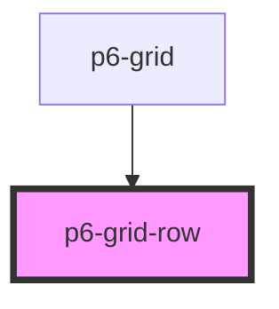

# p6-grid-row

<!-- Auto Generated Below -->

## Properties

| Property   | Attribute  | Description            | Type      | Default |
| ---------- | ---------- | ---------------------- | --------- | ------- |
| `selected` | `selected` | Is row selected or not | `boolean` | `false` |

## Dependencies

### Used by

- [p6-grid](../..)

### Graph

---

_Built with [StencilJS](https://stenciljs.com/)_
