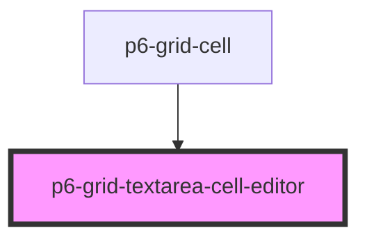

# p6-grid-textarea-cell-editor

<!-- Auto Generated Below -->

## Properties

| Property              | Attribute | Description        | Type                              | Default     |
| --------------------- | --------- | ------------------ | --------------------------------- | ----------- |
| `column` _(required)_ | --        | the cell column    | `Column<Record<string, unknown>>` | `undefined` |
| `row` _(required)_    | --        | the cell row       | `Row<Record<string, unknown>>`    | `undefined` |
| `value` _(required)_  | `value`   | Current cell value | `string`                          | `undefined` |

## Events

| Event                    | Description                             | Type                                                           |
| ------------------------ | --------------------------------------- | -------------------------------------------------------------- |
| `p6GridCellValueChanged` | the cell value changed                  | `CustomEvent<CellValueChangedDetail<Record<string, unknown>>>` |
| `p6GridEditingCell`      | the editing status of this cell changed | `CustomEvent<EditingCellDetail<Record<string, unknown>>>`      |

## Dependencies

### Used by

- [p6-grid-cell](../p6-grid-cell)

### Graph

---

_Built with [StencilJS](https://stenciljs.com/)_
